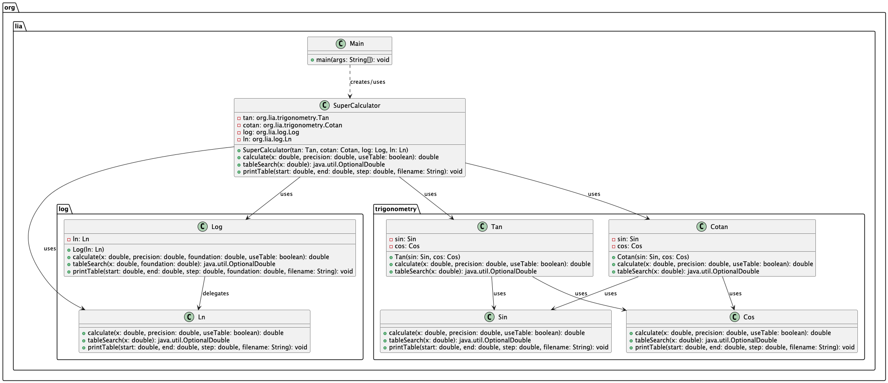
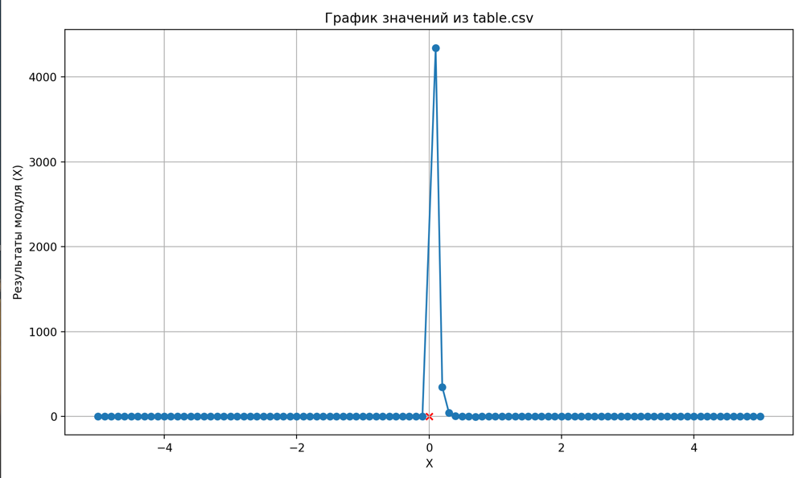

# Отчет по лабораторной работе №2 по курсу "Тестирование программного обеспечения"
### Выполнила Старостина Елена, P3319, 414257

## Текст задания:
Провести интеграционное тестирование программы, осуществляющей вычисление системы функций (в соответствии с вариантом).
```
x <= 0 : ((tan(x) * cot(x)) ^ 2)
x > 0 : (((((log_5(x) + log_3(x)) ^ 2) * (ln(x) - (log_3(x) * log_5(x)))) ^ 2) + log_3(x))
```

Правила выполнения работы:
- Все составляющие систему функции (как тригонометрические, так и логарифмические) должны быть выражены через базовые (тригонометрическая зависит от варианта; логарифмическая - натуральный логарифм).
- Структура приложения, тестируемого в рамках лабораторной работы, должна выглядеть следующим образом (пример приведён для базовой тригонометрической функции sin(x)):
- Обе "базовые" функции (в примере выше - sin(x) и ln(x)) должны быть реализованы при помощи разложения в ряд с задаваемой погрешностью. Использовать тригонометрические / логарифмические преобразования для упрощения функций ЗАПРЕЩЕНО.
- Для КАЖДОГО модуля должны быть реализованы табличные заглушки. При этом, необходимо найти область допустимых значений функций, и, при необходимости, определить взаимозависимые точки в модулях.
- Разработанное приложение должно позволять выводить значения, выдаваемое любым модулем системы, в сsv файл вида «X, Результаты модуля (X)», позволяющее произвольно менять шаг наращивания Х. Разделитель в файле csv можно использовать произвольный.

Порядок выполнения работы:
- Разработать приложение, руководствуясь приведёнными выше правилами.
- С помощью JUNIT5 разработать тестовое покрытие системы функций, проведя анализ эквивалентности и учитывая особенности системы функций. Для анализа особенностей системы функций и составляющих ее частей можно использовать сайт https://www.wolframalpha.com/.
- Собрать приложение, состоящее из заглушек. Провести интеграцию приложения по 1 модулю, с обоснованием стратегии интеграции, проведением интеграционных тестов и контролем тестового покрытия системы функций.

## Ход работы:
1. Было разработано приложение с заданной структурой: sin(x), cos(x) и ln(x) находятся через сумму ряда, log(x), ctg(x) и tg(x) выражаются через них, основной модуль зависит от всех вышеперечисленных
2. Были написаны unit-тесты для всех модулей, с помощью чего была проверена корректная работа каждого модуля по отдельности. Для тестирования модулей, имеющих зависимости, были использованы моки, которые, в свою очередь, отдавали результат вычисления выражения из Math
3. Было проведено интеграционное тестирование: на первом этапе были написаны тесты для интеграции log и ln, а также ctg с sin&cos и tg с sin&cos. На втором этапе было проведено интеграционное тестирование всего приложения



## Вывод:
В ходе выполнения лабораторной работы я уяснила важность грамотной организации минимальной связности модулей, что позволяет провести модульное тестирование с помощью заглушек, а интеграцинное тестирование - уже с использованием реальных зависимостей.

## График функции:

